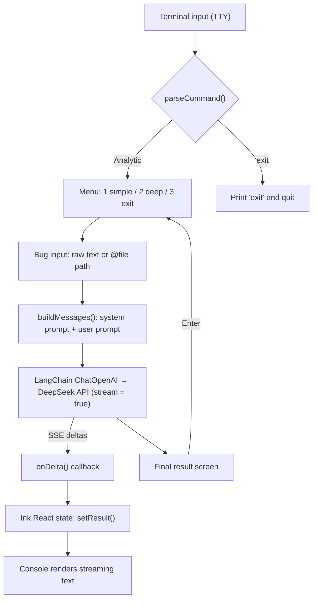
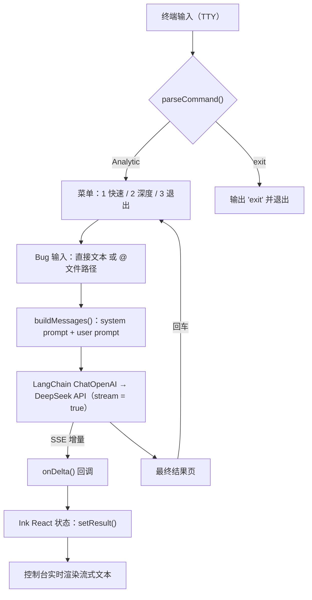

# BugAnalytic-Agent

An interactive **LangChain + DeepSeek** Bug analysis agent, built with **Node.js + React (Ink) + TypeScript**.

## English

### What it is

BugAnalytic-Agent is an interactive CLI that turns a raw bug report into a structured analysis through LangChain's `ChatOpenAI` integration, using the DeepSeek Chat Completions API and streaming the answer back to your terminal.

- Type `Analytic` to open the analysis menu
- Menu: `1. simple-analytic` (quick analysis) / `2. deep-analytic` (in-depth analysis) / `3. exit`
- Type `exit` to print `exit` and quit

### Quick start

#### 1. Install dependencies

```bash
npm install
```

#### 2. Configure the DeepSeek API key

The key is read from the `DEEPSEEK_API_KEY` environment variable (you can also copy `.env.example` to `.env` and fill it in):

```bash
# Windows PowerShell
$env:DEEPSEEK_API_KEY = "sk-xxxx"

# Linux / macOS
export DEEPSEEK_API_KEY="sk-xxxx"
```

Supported environment variables:

| Variable | Required | Description | Default |
| --- | --- | --- | --- |
| `DEEPSEEK_API_KEY` | Yes | DeepSeek API key | - |
| `DEEPSEEK_BASE_URL` | No | API base URL | `https://api.deepseek.com` |
| `DEEPSEEK_MODEL` | No | Model name | `deepseek-chat` |

#### 3. Run

```bash
# Development (run directly with tsx)
npm run dev

# Or build and run
npm run build
npm start
```

#### Usage

1. Start the CLI and type `Analytic` + Enter to open the menu
2. Enter `1` for simple-analytic (quick) or `2` for deep-analytic (in-depth)
3. Paste a bug description, or use `@examples/bug-login.txt` to read a sample file
4. Watch DeepSeek stream the analysis back into the console
5. Enter `3` or `exit` to print `exit` and quit

> When stdin is not a TTY (for example, a pipe), the CLI automatically switches to line mode, which is convenient for CI and scripting:
>
> ```bash
> printf "Analytic\n3\n" | node dist/cli.js
> ```

### Architecture

The data flow is: **user input → command parsing → prompt building → LangChain model call → streamed result back to the console**.



The same flow in plain text (`input -> LangChain -> DeepSeek call -> console`):

```
1. INPUT
   terminal (TTY)  ->  "Analytic"  ->  parseCommand("idle")  ->  main menu
   main menu       ->  "1" / "2"   ->  parseCommand("menu")  ->  simple | deep
   bug description ->  raw text or "@examples/bug-login.txt" ->  resolveBugInput()

2. PROMPT
   buildMessages(kind, bugText)  ->  [ system prompt , user prompt ]

3. LANGCHAIN MODEL CALL
   analyzeBug() -> chatCompletion() -> ChatOpenAI.stream()
   POST {DEEPSEEK_BASE_URL}/chat/completions
   body: { model: deepseek-chat, messages, stream: true, temperature: 0.7 }
   response: text/event-stream (SSE, parsed by LangChain)
        |
        +-- "data: {...}" -> delta.content -> onDelta(delta)   (each chunk)
        +-- "data: [DONE]"                  -> full text       (end of stream)

4. CONSOLE OUTPUT
   onDelta() -> setResult(full) -> Ink re-renders -> streaming text appears live
   stream ends -> "result" screen -> Enter -> back to main menu
```

Key pieces:

- `cli.tsx` — entry point: renders the Ink app for a TTY, otherwise runs line mode
- `app.tsx` — Ink React state machine (`idle → menu → input → analyzing → result`)
- `llm/prompts.ts` — builds the system/user messages for both analysis modes
- `llm/langchain.ts` — LangChain `ChatOpenAI` client, configured for DeepSeek's OpenAI-compatible API and streaming tokens
- `llm/analyze.ts` — orchestrates config + prompt + LangChain model call
- `onDelta` — pushes each streamed chunk into React state so the console updates live

### Tests

```bash
npm test
```

### Project layout

```
src/
├── cli.tsx               # CLI entry (renders React UI for TTY, otherwise line mode)
├── app.tsx               # Ink React main UI and state machine
├── config.ts             # Reads environment variables (DEEPSEEK_API_KEY, etc.)
├── command.ts            # Command parsing (Analytic / 1 / 2 / 3 / exit)
├── bug-input.ts          # Bug input (raw text or @file path)
├── line-mode.ts          # Non-interactive line-mode runner
├── texts.ts              # Banner / menu text
├── components/           # Banner, Menu, Spinner, TextInput components
├── llm/
│   ├── langchain.ts      # LangChain ChatOpenAI client (DeepSeek streaming)
│   ├── prompts.ts        # Simple / deep analysis prompts
│   └── analyze.ts        # Analysis orchestration
└── *.test.ts             # Unit tests
```

### Tech stack

- Node.js 18+ (built-in `fetch`)
- React 18 + Ink 5 (React renderer for terminals)
- TypeScript 5
- LangChain (`@langchain/core` + `@langchain/openai`)
- DeepSeek API (`deepseek-chat`, streaming output via OpenAI-compatible endpoint)

## 中文说明

基于 **LangChain + DeepSeek** 的 Bug 分析 Agent。使用 **Node.js + React (Ink) + TypeScript** 实现的交互式 CLI：

- 输入 `Analytic` 进入分析菜单
- 菜单：`1. simple-analytic`（快速分析）/ `2. deep-analytic`（深度分析）/ `3. exit`（退出）
- 输入 `exit` 输出 `exit` 并退出

### 快速开始

#### 1. 安装依赖

```bash
npm install
```

#### 2. 配置 DeepSeek API Key

API Key 从环境变量 `DEEPSEEK_API_KEY` 读取（也可复制 `.env.example` 为 `.env` 填写）：

```bash
# Windows PowerShell
$env:DEEPSEEK_API_KEY = "sk-xxxx"

# Linux / macOS
export DEEPSEEK_API_KEY="sk-xxxx"
```

支持的环境变量：

| 变量 | 必填 | 说明 | 默认值 |
| --- | --- | --- | --- |
| `DEEPSEEK_API_KEY` | 是 | DeepSeek API Key | - |
| `DEEPSEEK_BASE_URL` | 否 | API 地址 | `https://api.deepseek.com` |
| `DEEPSEEK_MODEL` | 否 | 模型名称 | `deepseek-chat` |

#### 3. 运行

```bash
# 开发模式（tsx 直接运行）
npm run dev

# 或先构建再运行
npm run build
npm start
```

#### 使用示例

1. 启动后输入 `Analytic` 回车，进入图形菜单
2. 输入 `1` 选择 simple-analytic（快速分析），或 `2` 选择 deep-analytic（深度分析）
3. 粘贴 Bug 描述，或输入 `@examples/bug-login.txt` 读取示例文件
4. 等待 DeepSeek 返回流式分析结果
5. 输入 `3` 或 `exit`，CLI 输出 `exit` 并退出

> 非交互（stdin 非 TTY，如管道）时自动切换为行输入模式，方便 CI / 脚本调用：
>
> ```bash
> printf "Analytic\n3\n" | node dist/cli.js
> ```

### 项目架构

整体数据流向为：**用户输入 → 命令解析 → Prompt 构建 → 调用 DeepSeek → 结果流式返回到控制台**。



同一流程的纯文本视图（`输入 -> LangChain -> 调用 DeepSeek -> 返回控制台`）：

```
1. 输入（INPUT）
   终端（TTY）   ->  输入 "Analytic"  ->  parseCommand("idle")  ->  主菜单
   主菜单        ->  输入 "1" / "2"   ->  parseCommand("menu")  ->  simple | deep
   Bug 描述      ->  直接文本 或 "@examples/bug-login.txt"  ->  resolveBugInput()

2. 构建 Prompt
   buildMessages(kind, bugText)  ->  [ system prompt , user prompt ]

3. 调用 LangChain 模型
   analyzeBug() -> chatCompletion() -> ChatOpenAI.stream()
   POST {DEEPSEEK_BASE_URL}/chat/completions
   body: { model: deepseek-chat, messages, stream: true, temperature: 0.7 }
   response: text/event-stream（SSE，由 LangChain 解析）
        |
        +-- "data: {...}"   -> delta.content -> onDelta(delta)   （每个分片）
        +-- "data: [DONE]"  -> 完整文本                          （流结束）

4. 返回控制台（CONSOLE OUTPUT）
   onDelta() -> setResult(full) -> Ink 重新渲染 -> 流式文本实时显示
   流结束 -> "result" 结果页 -> 回车 -> 返回主菜单
```

关键模块：

- `cli.tsx` — 入口：TTY 下渲染 Ink 应用，否则走行模式
- `app.tsx` — Ink React 状态机（`idle → menu → input → analyzing → result`）
- `llm/prompts.ts` — 构建两种分析模式的 system / user 消息
- `llm/langchain.ts` — LangChain `ChatOpenAI` 客户端，通过 DeepSeek 的 OpenAI 兼容 API 流式调用
- `llm/analyze.ts` — 编排配置 + Prompt + LangChain 模型调用
- `onDelta` — 把每个流式分片写入 React 状态，实现控制台实时刷新

### 测试

```bash
npm test
```

### 项目结构

```
src/
├── cli.tsx               # CLI 入口（TTY 渲染 React UI，否则行模式）
├── app.tsx               # Ink React 主界面与状态机
├── config.ts             # 读取环境变量（DEEPSEEK_API_KEY 等）
├── command.ts            # 命令解析（Analytic / 1 / 2 / 3 / exit）
├── bug-input.ts          # Bug 输入（直接文本 或 @文件路径）
├── line-mode.ts          # 非交互行模式运行器
├── texts.ts              # Banner / 菜单图形文本
├── components/           # Banner、Menu、Spinner、TextInput 组件
├── llm/
│   ├── langchain.ts      # LangChain ChatOpenAI 客户端（DeepSeek 流式）
│   ├── prompts.ts        # 快速 / 深度分析 Prompt
│   └── analyze.ts        # 分析编排
└── *.test.ts             # 单元测试
```

### 技术栈

- Node.js 18+（内置 fetch）
- React 18 + Ink 5（终端 React 渲染）
- TypeScript 5
- LangChain（`@langchain/core` + `@langchain/openai`）
- DeepSeek API（`deepseek-chat`，通过 OpenAI 兼容接口流式输出）
